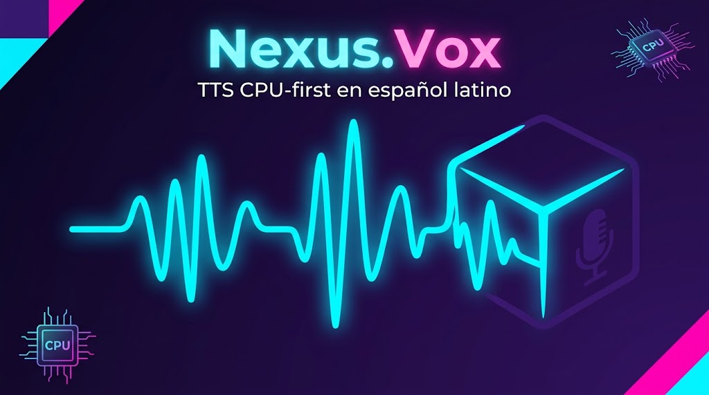

<div align="center">



# Nexus.Vox

**TTS CPU-first nativo en español latino con clonación de voz.**

[](https://www.python.org/)
[](https://opensource.org/licenses/MIT)
[](https://github.com/kennyji1771/nexus-voz)
[](https://github.com/kennyji1771/nexus-voz)
[](https://github.com/kennyji1771/nexus-voz)

</div>

---

## ✨ Características

- 🎙️ **Clonación de voz zero-shot** — dale 15 segundos de audio y listo.
- 🇲🇽 **Español latinoamericano nativo** — pensado para LatAm.
- ⚡ **CPU-first** — no necesitas GPU. Corre en laptops normales.
- 🪶 **Ligero** — instala y usa, sin APIs web ni servicios externos.
- 🐍 **Python 3.10 a 3.14** — compatible con las versiones actuales.
- 🌐 **CLI + API Python + servidor HTTP** — úsalo como quieras.
- 🔓 **Open source MIT** — fork de Kyutai Pocket TTS, todo transparente.

---

## 📦 Instalación

### Desde código fuente (recomendado)

```bash
git clone https://github.com/kennyji1771/nexus-voz.git
cd nexus-voz
pip install -e .
```

### Requisitos

- Python 3.10, 3.11, 3.12, 3.13 o 3.14
- PyTorch 2.5+ (versión CPU, no requiere CUDA)
- ~2 GB de disco (incluye modelos descargados)

---

## 🚀 Uso rápido

### Generar audio (CLI)

```bash
# Texto simple con la voz por defecto (Kenny.Ji si existe localmente, lola si no)
nexus-vox generate --text "Hola, bienvenido a Nexus.Vox"

# Especificar archivo de salida
nexus-vox generate --text "Hola mundo" --output-path saludo.wav

# Elegir idioma
nexus-vox generate --text "Hello world" --language english
```

### Desde Python

```python
from nexus_vox import TTSModel

model = TTSModel.load_model(language="spanish_24l")
voice_state = model.get_state_for_audio_prompt("kenny_ji_24l.safetensors")

audio = model.generate_audio_stream(
    model_state=voice_state,
    text_to_generate="Hola, esto es Nexus.Vox.",
)
```

---

## 🎙️ Clonación de voz

### 1. Graba tu voz de referencia

- **15-30 segundos** de audio.
- Formato: WAV o MP3.
- Ambiente silencioso, sin ruido de fondo.
- Frases variadas (no monótonas).

### 2. Convierte tu audio en un embedding

```bash
nexus-vox export-voice mi_voz.wav mi_voz.safetensors --language spanish_24l
```

Esto crea un archivo `.safetensors` (~18 MB) con el embedding de tu voz.

### 3. Genera audio con tu voz

```bash
nexus-vox generate \
  --text "Hola, esta es mi voz clonada." \
  --voice mi_voz.safetensors \
  --language spanish_24l
```

### ⚠️ Requisitos de HuggingFace

El modelo de clonación (`kyutai/pocket-tts`) requiere autenticación en HuggingFace:

1. Crea cuenta en https://huggingface.co/join
2. Acepta los términos en https://huggingface.co/kyutai/pocket-tts
3. Crea un token en https://huggingface.co/settings/tokens (tipo **Read**)
4. Autentica:

```bash
pip install -U "huggingface_hub[cli]"
hf auth login --token hf_TU_TOKEN
```

### 🔒 Uso responsable

Nexus.Vox solo debe usarse para clonar voces con **consentimiento explícito**. **No se permite** clonar voces de terceros sin autorización. Ver `NOTICE.md` para más detalles.

---

## 🗣️ Voces disponibles

| Nombre | Idioma | Tipo |
|---|---|---|
| **Kenny.Ji** | Español LatAm | Clonada local (por defecto si existe) |
| `lola` | Español (ES) | Predefinida Kyutai |
| `giovanni` | Italiano | Predefinida Kyutai |
| `juergen` | Alemán | Predefinida Kyutai |
| `rafael` | Portugués | Predefinida Kyutai |
| `estelle` | Francés | Predefinida Kyutai |
| `alba` | Inglés | Predefinida Kyutai (fallback) |

Lista completa: `nexus_vox/utils/utils.py` → `_ORIGINS_OF_PREDEFINED_VOICES`

---

## 🌐 Servidor HTTP

Levanta un servidor FastAPI para uso desde cualquier cliente HTTP:

```bash
nexus-vox serve --host 0.0.0.0 --port 8000
```

Luego:

```bash
curl -X POST http://localhost:8000/tts \
  -H "Content-Type: application/json" \
  -d '{"text": "Hola mundo", "voice": "lola"}'
```

---

## 📚 Documentación

- [`NOTICE.md`](NOTICE.md) — atribución y licencias de terceros.
- [`CONTRIBUTING.md`](CONTRIBUTING.md) — cómo contribuir.
- [`training/README.md`](training/README.md) — entrenamiento de modelos custom.

---

## 🙏 Créditos

Nexus.Vox es un **fork de [Kyutai Pocket TTS](https://github.com/kyutai-labs/pocket-tts)**.

- **Código original:** © Kyutai Labs, licencia MIT.
- **Pesos del modelo:** © Kyutai Labs, licencia CC-BY-4.0.
- **Modificaciones Nexus.Vox:** © 2026 Kenny Ji.

Ver [`NOTICE.md`](NOTICE.md) para la atribución completa.

---

## 📄 Licencia

MIT License. Ver [`LICENSE`](LICENSE).

Uso comercial permitido con atribución. Los pesos del modelo tienen sus propias restricciones (CC-BY-4.0) — revisa los términos del repositorio [kyutai/pocket-tts](https://huggingface.co/kyutai/pocket-tts) antes de uso comercial.

---

<div align="center">

**Hecho con 🎙️ en Venezuela 🇻🇪**

[Reportar un bug](https://github.com/kennyji1771/nexus-voz/issues) · [Solicitar una feature](https://github.com/kennyji1771/nexus-voz/issues)

</div>